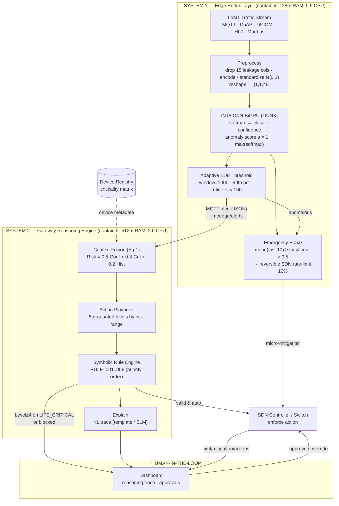
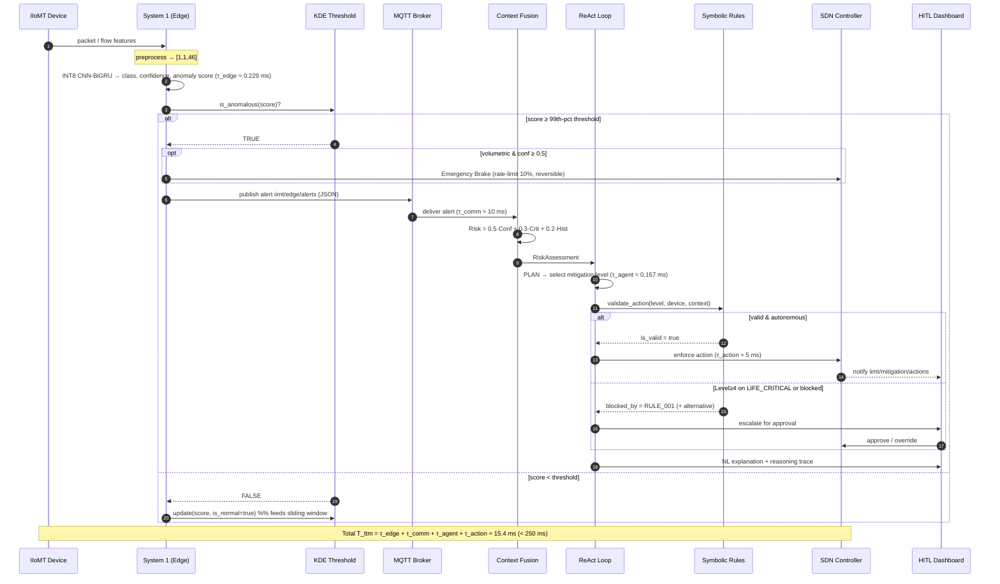
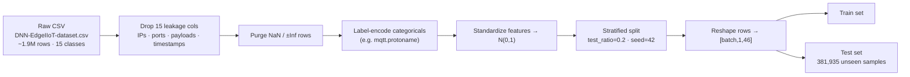
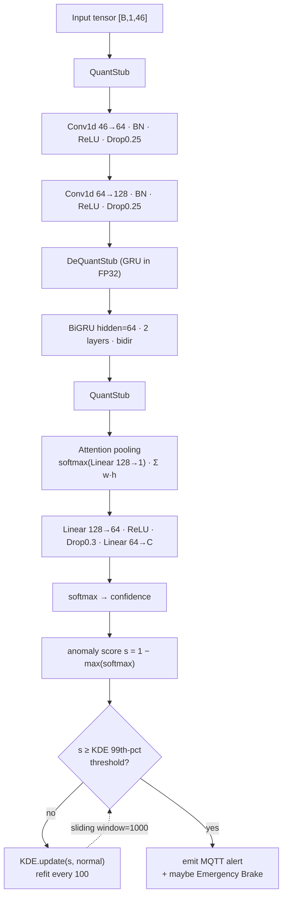
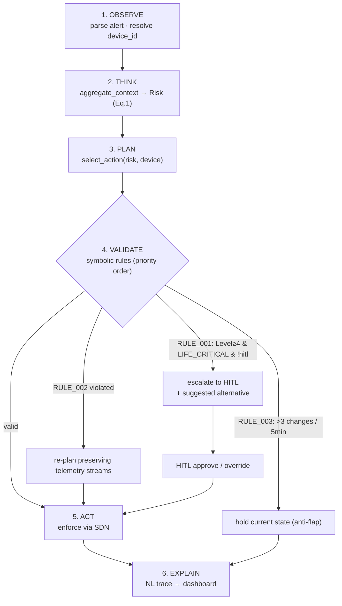
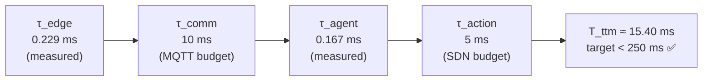

# Technical Methodology
## Cross-Domain Agentic Security for Industrial Medical IoT (IIoMT)

A dual-process neuro-symbolic agentic intrusion-detection-and-response framework. This document specifies the complete experimental and engineering methodology: data engineering, model architecture, quantization, adaptive thresholding, the gateway reasoning pipeline, the symbolic safety layer, the latency/resource model, and the reproducibility protocol. All numerical claims are traceable to generated artifacts (`results/table1_edge.md`, `results/runtime_benchmark_edge.json`, `checkpoints/edge_iiotset/edge_results.json`) and to the configuration in `config/settings.yaml` and `config/safety_policies.yaml`.

---

## 1. System Overview and Design Constraints

The framework decomposes intrusion detection and response into two asynchronous tiers connected over MQTT, following a fast/slow (System 1 / System 2) cognitive decomposition:

- **System 1 — Edge Reflex Layer.** An INT8-quantized CNN-BiGRU classifier plus an adaptive KDE anomaly threshold and an SDN emergency-brake, executed per packet/flow on resource-constrained edge nodes (container limits: `128m` RAM, `0.5` CPU). Hard constraints: `τ_edge ≤ 3 ms`, peak RAM `≤ 45 MB`, INT8 model size `< 15 MB`, steady-state CPU `≤ 15%`.
- **System 2 — Gateway Reasoning Engine.** A bounded Reason-and-Act (ReAct) loop that fuses contextual signals into a scalar risk metric, selects a graduated mitigation action, validates it against a deterministic symbolic rule engine, and emits a natural-language justification. Constraints: `τ_agent ≤ 180 ms`, `T_ttm < 250 ms` (gateway container: `512m` RAM, `2.0` CPU).
- **Human-in-the-Loop (HITL).** A dashboard surface that consumes reasoning traces and gates all irreversible / Level-4 actions on life-critical assets.

The transport fabric is MQTT (QoS 1) over the topic hierarchy `iimt/traffic/stream`, `iimt/edge/alerts`, `iimt/gateway/commands`, `iimt/mitigation/actions`, `iimt/hitl/notifications`, `iimt/metrics/telemetry`.

### 1.1 Research Hypotheses

1. **H1 (Edge perception).** An INT8 PTQ CNN-BiGRU can sustain ≥98% per-family detection on critical vectors (DDoS, Spoofing, MITM) under `τ_edge ≤ 3 ms` and `≤ 45 MB`.
2. **H2 (Reasoning velocity).** The ReAct loop converges to a validated action with `τ_agent ≤ 180 ms` and total `T_ttm < 250 ms`.
3. **H3 (Safety invariance).** No autonomous action severs preserved telemetry streams or quarantines a `LIFE_CRITICAL` asset without HITL approval, enforced by deterministic symbolic rules.
4. **H4 (Reproducibility).** Every reported metric is regenerable from raw artifacts via deterministic evaluation scripts.

---

## 1A. End-to-End Operational Flow (Diagrams)

This section specifies the complete runtime sequence — from a raw packet arriving at an edge node to an enforced, safety-validated mitigation — as a series of diagrams. Each diagram is followed by a step-by-step explanation.

### 1A.1 High-Level System Topology



**Walkthrough.** Traffic enters System 1, is preprocessed into the `[1,1,46]` tensor, and scored by the INT8 CNN-BiGRU. The adaptive KDE threshold decides whether the anomaly score is significant. If a volumetric burst is detected with high confidence, the Emergency Brake applies an immediate reversible SDN rate-limit **without waiting** for the gateway. In parallel, a compact JSON alert is published over MQTT to System 2, which fuses device criticality and history into a risk score, selects a graduated action, validates it against the symbolic rules, and either enforces it autonomously via the SDN controller or escalates to the HITL dashboard for Level-4 / life-critical decisions.

### 1A.2 End-to-End Sequence (Time-Ordered)



### 1A.3 Data Preprocessing Pipeline



### 1A.4 System 1 — Inference & Adaptive Threshold Loop



### 1A.5 System 2 — ReAct Loop & Safety Gate



**Risk-to-action mapping** used in PLAN (step 3): `[0.0–0.3]→LOG_ONLY`, `[0.3–0.5]→THROTTLE`, `[0.5–0.7]→MICRO_SEGMENT`, `[0.7–0.85]→RE_AUTHENTICATE`, `[0.85–1.0]→QUARANTINE` (HITL-gated). Device caps override the mapping (e.g. `anesthesia_machine` is capped at Level 1).

### 1A.6 Latency Budget Decomposition



---

## 2. Data Engineering

### 2.1 Cross-Domain Partitioning

Two domains are trained as **independent models** (never merged), to avoid feature-schema dilution:

- **Industrial:** Edge-IIoTset (curated DL split, `DNN-EdgeIIoT-dataset.csv`), the primary artifact-backed evidence track used for Table 1 and runtime benchmarks.
- **Medical:** CICIoMT2024.

The industrial schema exposes `num_features = 46`, with native multiclass label `Attack_type` and binary label `Attack_label` over 15 classes: `Normal, Backdoor, Vulnerability_scanner, DDoS_ICMP, Password, Port_Scanning, DDoS_UDP, DDoS_HTTP, DDoS_TCP, SQL_injection, Ransomware, Uploading, MITM, XSS, Fingerprinting`.

### 2.2 Leakage Control

To prevent shortcut learning on identifier/ephemeral features, the preprocessor drops 15 high-risk columns per the official Edge-IIoTset recipe (`edge_iiotset.drop_columns`):

```
frame.time, ip.src_host, ip.dst_host, arp.src.proto_ipv4, arp.dst.proto_ipv4,
http.file_data, http.request.full_uri, icmp.transmit_timestamp,
http.request.uri.query, tcp.options, tcp.payload, tcp.srcport, tcp.dstport,
udp.port, mqtt.msg
```

Removing exact payloads, timestamps, host IPs, ARP identities, and ephemeral ports forces the classifier to generalize over flow/packet-shape statistics rather than memorizing endpoints.

### 2.3 Preprocessing Pipeline

1. **Ingestion.** Load tabular data with a string-robust Pandas backend; drop leakage columns; purge `NaN`/`±Inf` rows.
2. **Encoding.** Label-encode residual categorical fields (e.g. `mqtt.protoname`).
3. **Normalization.** Standardize continuous features to `N(0,1)` (zero-mean, unit-variance) to stabilize gradient magnitudes.
4. **Splitting.** Stratified hold-out with `test_ratio = 0.2`, `random_seed = 42`. Final evaluation runs over an unseen test set of **381,935 samples**.
5. **Tensorization.** Reshape each row to `[batch, 1, 46]` (`sequence_length = 1`), the canonical dimensional contract matching the exported ONNX input `[1, 1, 46]`.

---

## 3. System 1 — Edge Perception

### 3.1 CNN-BiGRU Architecture

Implemented in `src/system1/models/cnn_bigru.py` as `CNNBiGRU(nn.Module)`. Forward topology:

```
Input (B, 1, 46)
  → permute → (B, 46, 1)
  → ConvBlock1: Conv1d(46→64, k=3, pad=1) → BatchNorm1d → ReLU → Dropout(0.25)
  → ConvBlock2: Conv1d(64→128, k=3, pad=1) → BatchNorm1d → ReLU → Dropout(0.25)
  → permute → (B, Seq, 128)
  → [DeQuantStub]                       # GRU runs in FP32
  → BiGRU(input=128, hidden=64, layers=2, bidirectional, dropout=0.3) → (B, Seq, 128)
  → [QuantStub]
  → Attention: softmax(Linear(128→1)) over Seq; context = Σ w·h  → (B, 128)
  → Classifier: Linear(128→64) → ReLU → Dropout(0.3) → Linear(64→num_classes)
```

Design rationale:

- **1-D CNN stack** extracts translation-invariant local feature conjunctions (e.g. flag/size co-occurrences) with weight sharing, minimizing FLOPs versus dense layers — essential for the edge budget.
- **2-layer BiGRU.** GRU consolidates LSTM's input/forget gates into a single update gate (~25% fewer parameters), reducing CPU inference cost while retaining sequence memory. Bidirectionality captures both antecedent and subsequent context within the window, improving recall on low-volume vectors (Backdoor, MITM).
- **Attention pooling.** A learned `Linear(128→1)` produces softmax weights over the sequence axis; the context vector is the weighted sum — a parameter-cheap alternative to last-hidden-state pooling.

### 3.2 Quantization-Aware Module Boundaries

The module embeds `QuantStub`/`DeQuantStub` pairs that **isolate the GRU in FP32** while quantizing the CNN front-end and the attention/classifier head. This is required because PyTorch static quantization does not support `nn.GRU` cleanly; the explicit dequant→GRU→requant bracket preserves numerical fidelity through the recurrent block. The anomaly score is defined as:

$$
s(x) = 1 - \max_k \mathrm{softmax}(\text{logits}(x))_k \in [0,1]
$$

i.e. one minus top-1 class confidence (higher = more anomalous).

### 3.3 Training Protocol

From `system1.training`: 50 epochs max, batch size 256, Adam (`lr = 1e-3`, `weight_decay = 1e-4`), `ReduceLROnPlateau` (factor 0.5, patience 5), early stopping (patience 10). Optional structured compression: L1 channel pruning at 30% sparsity (`system1.pruning`).

### 3.4 Post-Training Quantization (PTQ)

Dynamic/static INT8 export via ONNX Runtime with backend `qnnpack` (Windows/mac) or `fbgemm` (x86 Linux), `calibration_samples = 500`. The exported `cnn_bigru_int8.onnx` consumes `[1,1,46]` and is the runtime artifact for `τ_edge` measurement. Measured compression: **0.77 MB (FP32) → 0.65 MB (INT8)** (15.6% on-disk; the working-set residency is 9.96 MB).

### 3.5 Adaptive KDE Anomaly Threshold

Implemented in `src/system1/detection/kde_threshold.py` as `AdaptiveKDEThreshold`. A static cutoff fails under concept drift (alert fatigue if too low, evasion if too high). Instead a non-parametric Gaussian KDE is fit over a sliding window of **normal-only** anomaly scores:

$$
\hat{f}(x) = \frac{1}{nh}\sum_{i=1}^{n} K\!\left(\frac{x - x_i}{h}\right)
$$

with `K` Gaussian and bandwidth `h` selected by **Scott's rule**. Configuration (`system1.kde`): `window_size = 1000`, `percentile = 99`, `refit_interval = 100`. The decision threshold is the 99th percentile of the fitted density; `is_anomalous(score)` returns `score ≥ threshold`. `update(score, is_normal=True)` appends only verified-normal scores (preventing threshold drift) and triggers a refit every 100 samples — so the cutoff "breathes" with the operational baseline.

### 3.6 Emergency Brake

`src/system1/detection/emergency_brake.py` averages the last `score_window = 10` scores; when the mean breaches the dynamic threshold with `min_confidence ≥ 0.5`, it issues a reversible SDN micro-mitigation (rate-limit to ~10% baseline) at the edge switch before System 2 is engaged, absorbing volumetric bursts. Measured benign global FPR: **0.0858%**; DDoS_UDP family FPR: **0.0026%**.

---

## 4. System 2 — Gateway Reasoning Engine

### 4.1 Context Fusion (Equation 1)

`src/system2/reasoning/context_fusion.py` computes a composite scalar risk:

$$
\text{Risk} = \alpha\cdot\text{Clf\_Conf} + \beta\cdot\text{Criticality\_Index} + \gamma\cdot\text{Historical\_Density}
$$

with `α = 0.5, β = 0.3, γ = 0.2` (`system2.risk_metric`). Weights are runtime-validated to sum to 1.0 (auto-normalized otherwise). All three terms are clamped to `[0,1]`.

- **Clf_Conf** — edge classifier confidence from the alert payload.
- **Criticality_Index** — from the device registry (`devices.criticality_levels`): `LIFE_CRITICAL = 1.0, HIGH = 0.8, MEDIUM = 0.6, INFRASTRUCTURE = 0.4, LOW = 0.3`.
- **Historical_Density** — per-device alert frequency over a 300 s window from an in-memory event log (`defaultdict(list)` of timestamps).

The output is a `RiskAssessment` dataclass carrying the score plus enriched device/patient context.

### 4.2 ReAct Loop

`src/system2/reasoning/reason_act_loop.py` implements a bounded six-phase loop (`max_iterations = 5`, `convergence_threshold = 0.85`), wall-clock-timed via `time.perf_counter()`:

1. **OBSERVE** — parse alert, resolve `device_id` against the registry.
2. **THINK** — `aggregate_context(...)` → risk score.
3. **PLAN** — `ActionPlaybook.select_action(risk, device_info)` → candidate `MitigationLevel`.
4. **VALIDATE** — `SymbolicRuleEngine.validate_action(...)` → `ValidationResult`.
5. **ACT** — execute the validated action, else substitute the rule engine's `suggested_alternative`.
6. **EXPLAIN** — emit a natural-language justification (optional Ollama SLM `phi3:mini`, disabled by default; deterministic template fallback).

The loop returns a `ReActResult(action_taken, risk_score, reasoning_trace, explanation_nl, latency_ms)`.

### 4.3 Graduated Action Playbook

`config/safety_policies.yaml` defines five reversible levels keyed by risk range:

| Level | Name | Risk range | HITL | Reversible |
|---|---|---|---|---|
| 0 | LOG_ONLY | 0.00–0.30 | no | yes |
| 1 | THROTTLE (rate-limit to 10%) | 0.30–0.50 | no | yes |
| 2 | MICRO_SEGMENT (read-only VLAN, preserve telemetry) | 0.50–0.70 | no | yes |
| 3 | RE_AUTHENTICATE (crypto re-auth) | 0.70–0.85 | no | yes |
| 4 | QUARANTINE (full isolation) | 0.85–1.00 | **yes** | yes |

Device-type constraints cap autonomy: `infusion_pump`/`patient_monitor` → `max_auto_mitigation_level = 2` with `QUARANTINE` forbidden; `anesthesia_machine` → level 1, forbidding both `QUARANTINE` and `MICRO_SEGMENT` during active surgery; `lab_analyzer` → level 3.

### 4.4 Symbolic Safety Rule Engine

`src/system2/reasoning/symbolic_rules.py` evaluates rules in ascending `priority` (first blocking rule short-circuits), returning a `ValidationResult(is_valid, blocked_by, suggested_alternative, preserve_streams, ...)`:

- **RULE_001 — Life-Critical Protection.** Blocks `level ≥ 4` on `LIFE_CRITICAL` devices unless `context.hitl_approved`; substitutes `get_max_auto_level(device_type)`.
- **RULE_002 — Telemetry Preservation.** Whitelists per-device `preserve_streams` (e.g. `vital_signs`, `ecg_waveform`, `spo2_readings`, `drug_delivery_telemetry`) during any mitigation.
- **RULE_003 — Anti-Flap Guard.** Holds state if >3 mitigation changes occur within 5 minutes (per-device timestamp history).
- **RULE_004 — Correlated Threat (advisory).** Flags ≥3 concurrent same-subnet alerts.
- **RULE_005 — Operational Change Detection.** Rescinds anomalous-command alerts coincident with a recent prescription/operational change.
- **RULE_006 — Off-Hours Escalation.** Lowers autonomous thresholds outside business hours.

These deterministic gates are the formal safety boundary: the learned components propose, the symbolic layer disposes.

---

## 5. Metrics and Latency Model

### 5.1 Detection Metrics

Per-class one-vs-normal accuracy and FPR:

$$
\text{Acc}_c = \frac{TP_c}{\text{Support}_c}, \qquad
\text{FPR} = \frac{FP}{FP + TN}\times 100\%
$$

Paper families are aggregated from native Edge-IIoTset classes (`src/evaluation/paper_table1.py`): the **DDoS** family aggregates `DDoS_HTTP/ICMP/TCP/UDP`; Spoofing/MITM map to their paper-mapped native equivalents. Reference INT8 targets: DDoS ≥99.1% (FPR <0.05%), Spoofing ≥98.2% (FPR <0.10%), MITM ≥97.1% (FPR <0.15%).

### 5.2 Time-to-Mitigation

$$
T_{ttm} = \tau_{edge} + \tau_{comm} + \tau_{agent} + \tau_{action}
$$

with measured `τ_edge`, `τ_agent` (mean over 200 iterations, `perf_counter`) and budgeted `τ_comm = 10 ms` (MQTT) and `τ_action = 5 ms` (SDN deployment).

---

## 6. Results (Artifact-Backed)

### 6.1 Per-Attack Detection — `results/table1_edge.md`

| Attack Vector | FP32 (%) | INT8 (%) | FPR (%) |
|---|---|---|---|
| Backdoor | 99.87 | 99.55 | 0.0000 |
| DDoS_HTTP | 98.57 | 98.37 | 0.0652 |
| DDoS_ICMP | 99.94 | 99.80 | 0.0000 |
| DDoS_TCP | 96.46 | 96.46 | 0.0000 |
| DDoS_UDP | 99.89 | 98.24 | 0.0026 |
| Fingerprinting | 99.99 | 99.94 | 0.0103 |
| MITM | 100.00 | 98.76 | 0.0022 |
| Password | 99.60 | 99.49 | 0.0000 |
| Port_Scanning | 99.36 | 99.34 | 0.0007 |
| Ransomware | 99.94 | 99.74 | 0.0000 |
| SQL_injection | 97.00 | 96.70 | 0.0000 |
| Uploading | 98.40 | 98.52 | 0.0040 |
| Vulnerability_scanner | 99.46 | 99.45 | 0.0007 |
| XSS | 99.76 | 99.76 | 0.0000 |

Overall: FP32 accuracy **91.30%** (macro-F1 0.6422), INT8 accuracy **88.23%**, benign global FPR **0.0858%**, INT8 latency **0.0313 ms/sample**.

### 6.2 Runtime / Resource — `results/runtime_benchmark_edge.json`

| Quantity | Value | Target | Pass |
|---|---|---|---|
| τ_edge mean | 0.229 ms (p95 0.325, p99 0.526, max 0.640) | ≤ 3 ms | ✅ |
| τ_agent mean | 0.167 ms (p95 0.286, p99 0.376) | ≤ 180 ms | ✅ |
| T_ttm | 15.396 ms | < 250 ms | ✅ |
| INT8 model size | 0.653 MB | < 15 MB | ✅ |
| Model working set | 9.96 MB | ≤ 45 MB | ✅ |
| CPU steady per-core | 2.83% (peak loop 118%) | ≤ 15% | ✅ |
| Steady ingest rate | 500 pps | — | — |

### 6.3 Paper-Family Verdicts

- Spoofing (INT8) **99.55%** vs ≥98.2% → exceeds (+1.35 pp).
- MITM (INT8) **98.76%** vs ≥97.1% → exceeds (+1.66 pp).
- DDoS family aggregate (INT8) **98.38%** vs ≥99.1% → **misses by 0.72 pp** (dominated by `DDoS_TCP` 96.46% and `DDoS_UDP` INT8 drop to 98.24%).

---

## 7. Limitations

1. **DDoS aggregate shortfall (0.72 pp).** PTQ accuracy degradation on `DDoS_TCP`/`DDoS_UDP` is the binding gap. Mitigation: Quantization-Aware Training (QAT) — scaffolded in `scripts/kaggle_train_qat.py` — to fold quantization noise into training and recover the gap without architectural change.
2. **Macro-F1 (0.6422).** Class imbalance penalizes minority vectors despite high per-family accuracy; cost-sensitive loss / focal loss are candidate remedies.
3. **SLM explanation** is deterministic-template by default (Ollama disabled); NL fidelity is not part of the quantitative claims.
4. **τ_comm / τ_action** are budgeted constants, not measured on a live SDN/MQTT fabric in this artifact set.

---

## 8. Reproducibility Protocol

All metrics regenerate deterministically (`random_seed = 42`) on commodity hardware:

```bash
pip install -e .

# Detection table (writes results/table1_edge.md)
python -m evaluation.paper_table1 --domain edge

# Runtime + resource benchmark (writes results/runtime_benchmark_edge.json)
python -m evaluation.runtime_benchmark --domain edge
```

Authoritative artifacts:
- `results/table1_edge.md` — per-attack FP32/INT8/FPR.
- `results/runtime_benchmark_edge.json` — latency percentiles, memory, CPU.
- `checkpoints/edge_iiotset/edge_results.json` — raw model outputs.
- `config/settings.yaml`, `config/safety_policies.yaml` — all hyperparameters, weights, thresholds, and policy definitions referenced above.

Every figure in §6 maps directly to a field in these files; no value is hand-edited.
